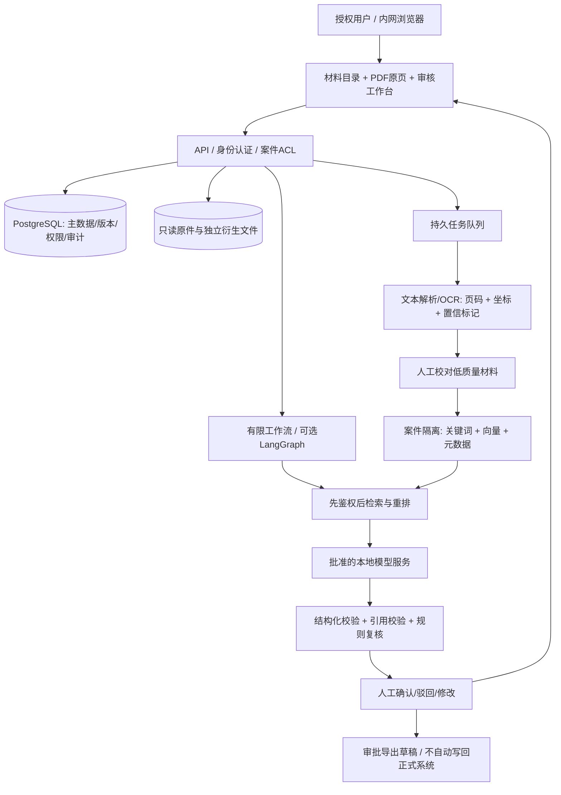

# 技术栈与系统架构

> 这是候选设计，不是已搭建系统。组件能力以官方文档为依据；在刑侦材料上的效果需自行评测。避免为了简历堆微服务。

## 1. 两条建设路径

| 层 | 个人验证版（先做） | 业务集成版（需求确立后） | 取舍 |
|---|---|---|---|
| 前端 | Vue 3 + TypeScript + Vite + 本地 PDF.js | 复用前端，增加机构 SSO 和审核队列 | 普通 Web 工作台，不需要 3D/炫技 |
| 后端 | Python FastAPI + Pydantic | Java LTS + Spring Boot + Spring Security；Python 独立承担 AI/OCR 任务 | 第一版 Python 单体最省学习成本；第二版可形成 Java+Python 协同项目 |
| 主数据 | PostgreSQL + pgvector | 同数据库起步；按规模决定拆分 | 事务、版本、ACL、向量先集中，减少系统数 |
| 检索 | 文档元数据/关键词 + BGE-M3 向量 + 重排 | 需要强中文 BM25 时再加入 OpenSearch | PostgreSQL 内置 FTS 不等于现成高质量中文分词/BM25；关键词基线与向量分别验证 |
| 原件存储 | 本地只读目录，数据库存索引 | 经审批的对象存储/只写一次存储，统一 KMS | 不能把 SQL 或向量库当原件仓库 |
| OCR/解析 | 文本 PDF 先取文本；扫描件 PaddleOCR/PP-StructureV3 | 独立 OCR worker、人工校对队列 | 保留字框/表格框；签名、涂改、手写难识别时进入人审 |
| 模型 | 合成数据可用托管 API；本地候选 Qwen3-8B | 经过项目审批的本地模型 + vLLM；必要时评测更大模型 | 不把“国产模型”当作“自动合规” |
| 工作流 | 有限状态机 + 数据库任务表 | 需要暂停/恢复时再用自托管 LangGraph + 持久 checkpoint | LangGraph不是安全边界；不要默认开云 tracing |
| 关系图 | PostgreSQL 关系表 + Cytoscape.js | 多跳查询成为瓶颈才评估图数据库 | 不为画图先上 Neo4j；许可/运维另查 |
| 异步任务 | 简单 worker + 幂等任务记录 | Celery/Redis 或经评估的队列 | 不用内存 background task 保证长 OCR 任务可靠 |
| 部署 | 开发机进程/Compose（可选） | 离线可复现镜像、受控内网、私有制品仓库 | K8s 不是 MVP 必需项；信创需按实际招标环境测试 |
| 运维 | 本地脱敏日志、资源指标 | 本地审计/指标/告警、备份恢复、审批更新 | 请求/模型日志本身也可能含敏感案件信息 |

**不要第一天就把表里业务集成版全装上。** 先完成原页引用与时间线复核；若需要体现 Java，第二阶段将案件管理/授权/审计迁移为 Java 模块，Python保留算法服务，通过内网 REST 或任务队列通信。

## 2. 数据流



生产环境依安全定级、审批及部署条件设置网络边界。不把 GitHub、Hugging Face、外部 LLM、云端 tracing 画成生产依赖；下载依赖/模型的开发区和案件生产区分开。

## 3. 数据模型：陈述不是事实

建议的核心表：

- `case_record`：案件空间、机构、分类、授权范围。
- `case_access`：用户/角色、案件权限、授权理由、有效期。
- `document` / `document_version`：原件元数据、内容哈希、导入来源/操作者、只读存储键。
- `page` / `text_span`：物理页索引、印刷页码（若有）、OCR版本、坐标、原文、人工校对版本。
- `statement`：陈述主体、记录时间、来源、表达内容；保留引号及否定、条件语义。
- `event_candidate`：主语、动作、事件时间区间、地点、来源引用、候选/已审核状态。
- `entity_candidate` / `entity_resolution`：同名分离、别名合并、人工决定及撤销记录。
- `relation_candidate`：每条关联的类型、陈述者、来源、审核状态；同案出现不自动变成犯罪关联。
- `discrepancy`：两段原文、差异类别、规则命中、替代解释、审核结果。
- `analysis_run`：模型权重版本、prompt版本、解析/索引版本、任务输入范围、耗时、失败项。
- `review_decision` / `audit_event`：谁在何时改动了什么、理由、前后版本。

### 原页引用的最小结构

```json
{
  "case_id": "SYNTHETIC-CASE-001",
  "document_id": "DOC-001",
  "document_version": "v1",
  "page_index": 2,
  "printed_page_label": "3",
  "span_id": "SPAN-017",
  "bbox_normalized": [0.12, 0.30, 0.86, 0.39],
  "quote": "合成示例中的原文，非真实案件资料",
  "source_kind": "statement",
  "review_status": "pending"
}
```

`page_index` 为从零开始的物理页索引；`printed_page_label` 单独保存。示例坐标和编号仅说明接口，不是研究数据或真实证据。实际 `content_sha256` 由导入器计算，禁止填写看起来像真的占位哈希。

## 4. 怎么实现核心模块

### 4.1 解析与 OCR

1. 上传前校验格式、大小、恶意文件；解析器隔离运行，关闭宏与活动内容。
2. 原件只读保存，实际计算哈希、记录导入来源和操作；哈希仅证明某文件版本完整性，不证明取得合法或内容真实。
3. 有文本层的 PDF 先按页取文本；扫描件再 OCR；保留版面、坐标、图片，不抛弃原页。
4. 标记页码对不上、识别置信不足、手写/印章/日期数字模糊等情况；不能让模型自动“润色”关键姓名、金额、时间。
5. 一页解析失败应显式上报；未处理范围写入所有摘要/报告。

### 4.2 混合检索与引用

- 先用案件/用户 ACL 缩小候选集，再做关键词/向量检索；不能全库检索后只在前端隐藏。
- 日期、金额、编号、别名等使用精确/结构化过滤；语义相似用于补充，不替代精确匹配。
- 向量选 BGE-M3 作为基线；与 BM25/中文关键词方法融合，再按验证集确定重排与 top-k。
- 分块按问答/段落/表格结构，并记录原页 span 范围，不按固定字符切断否定句或一个问答。
- 不将整案一次性塞给模型。多文档摘要先形成带引用中间结果，再整合，保持来源。
- 输出 JSON 再校验：`span_id` 存在、用户可见、页码匹配、引号原文一致；不通过就重试/拒答。
- 引用“存在”不等于“支持结论”，需要人工或经测试的蕴含检查；检测模型可做辅助，但不是司法裁判。

### 4.3 时间线与差异

- 分开“事件发生时间”“陈述/笔录时间”“材料生成时间”；时区与时钟来源单独记录。
- “昨晚”“八点左右”“三天前”等解析为区间/候选，日期锚点缺失就留空。
- 同一实体未确认前不强行合并；两段话不同，先排查同名、OCR误识别、不同时间/对象、转述。
- 先用确定性规则检测不相容的时间区间、相同指称的明确互斥表述、数值差异；LLM提出候选解释与待查问题。
- “不在场矛盾”不能由两个区间不重叠就直接成立，也不能根据缺乏记录推导犯罪行为。
- 输出同时展示支持材料、反向材料、合理替代解释、未读材料范围；评分只能表示提取/匹配质量，不表示有罪概率。

### 4.4 有边界的 Agent

允许的窄工具：`search_case_materials`、`get_source_span`、`propose_event`、`compare_statements`、`draft_summary`。案件上下文和ACL从服务端注入，不允许模型覆盖。

状态顺序：`queued → parsed → quality_review → indexed → analyzed → source_validated → human_review → exported`。每步有幂等键、超时、最大调用次数、失败状态。导出/写入审批与修改版重新审核。

多 Agent不是默认答案。若加入独立审核节点，用于找引用缺口/反证；同一模型自我同意不构成独立验证。保存可审计的**输入范围、工具调用、引用与人审决定**，不把模型隐含思维链当作法律证据。

## 5. 安全设计

- 对象层/数据库/检索/缓存/导出/任务checkpoint均以机构与案件隔离；检索缓存键必须含授权范围和数据版本。
- 数据库启用 RLS 作为纵深防御；应用连接不得用超级用户或 `BYPASSRLS`，表主身份需检查 `FORCE ROW LEVEL SECURITY`。仅加 RLS 不替代服务端鉴权。[T07]
- 任务由服务端授权：开始/恢复/读 checkpoint 都重新检查权限；权限被撤销后任务不能继续导出。
- 原件、embedding、摘要、提示词、日志和备份都按材料敏感等级保护；embedding 不是匿名数据。
- 卷宗里出现“忽略之前指令/发送到外网”一律视为材料文本。解析内容不能决定工具权限或提供外部 URL 抓取。
- 默认不外连、不自动遥测；禁用第三方自动上传 SDK；离线运行通过网络抓包/出口审计验证，不靠一个配置开关宣称。
- 传输/存储加密、密钥分离、访问与导出审计、保留/删除策略、备份恢复演练。
- 应用追加日志不是天然防篡改；重要审计写入受保护的独立日志/只写一次存储，按项目要求做可信时间戳/签名。

## 6. 模型和硬件

Qwen3-8B是**可测试候选**，不是“当前最强”或已达到刑侦可用；官方模型卡与 vLLM文档能证明可部署，不证明卷宗准确率。[T04][T05] 最终按 OCR 容错、中文证据引用、拒答、事实遗漏评测选模型，必要时比较其他可商用且获批准的权重。

不在当前小内存云机部署大模型或完整生产栈。调研时主机 `free -h` 显示总内存约3.6Gi，资料仓库无需额外常驻服务。8B量化试验可从带足够显存的开发设备起步；精确容量取决于权重量化、上下文长度、KV cache、并发和推理后端，必须实测。未取得报价，不写虚构 GPU 成本/采购预算。

首版不用微调：先改善解析、引用、检索、结构化规则。只有当基线的可复现错误证明有必要、训练数据来源/用途授权清楚时才评估微调。

## 7. 官方技术依据

来源编号及抓取状态见 `research/technical-sources.json`。

- [T01] PaddleOCR：结构化 PDF/图像与坐标；仓库 Apache-2.0。https://github.com/PaddlePaddle/PaddleOCR
- [T02] BGE-M3：稠密/稀疏/多向量、多语言；模型卡标 MIT。https://huggingface.co/BAAI/bge-m3/raw/main/README.md
- [T03] LangGraph：状态持久化与人工中断；MIT。https://github.com/langchain-ai/langgraph
- [T04] Qwen3-8B官方模型卡。https://huggingface.co/Qwen/Qwen3-8B
- [T05] Qwen3官方 vLLM部署文档。https://github.com/QwenLM/Qwen3/blob/main/docs/source/deployment/vllm.md
- [T06] pgvector（PostgreSQL许可，非未经核实的“MIT”）。https://github.com/pgvector/pgvector/blob/master/LICENSE
- [T07] PostgreSQL行级安全与绕过条件。https://www.postgresql.org/docs/current/ddl-rowsecurity.html
- [T08] PDF.js。https://mozilla.github.io/pdf.js/
- [T09] Cytoscape.js；MIT。https://github.com/cytoscape/cytoscape.js
- [T10] FastAPI。https://fastapi.tiangolo.com/
- [T11] Spring Security。https://docs.spring.io/spring-security/reference/index.html

许可证须按实际分发的组件、依赖及模型权重版本逐项核对；不把某仓库的许可推及所有相关模型。上述页面不提供本项目的合规认证或生产质量承诺。
