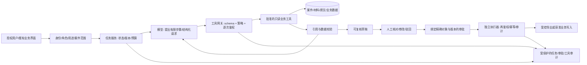

# AI Agent 在 To G 产品中怎样实现，怎样实现好

> 这是在国内外竞品与合规研究之后形成的工程分析。不是已上线系统或现有客户承诺。刑侦案例以授权材料整理为限；一般政务场景同样按真实用途和法律条件评估。资料依据编号见 `research/agent-engineering-sources.json`。

## 1. 核心判断：不是“给政府部署一个万能Agent”

**适合 To G 的设计通常是：确定性的业务系统管权限和流程，模型处理语言与不确定性，有限Agent负责在批准范围内选择下一步，关键决定仍由有职责的人作出。**

可以理解成两层：

- **内层灵活**：理解问题、拆解可做的任务、选择检索方式、补查原文、提出草稿。
- **外层确定**：谁能访问、能查哪个案件、能调用什么接口、什么时候需要审批、如何保存/导出，由代码、制度与授权决定。

不是让模型通过“我认为安全”来放行操作，也不是让一个更聪明的模型替代原有权限系统。[A01][A06][A07]

To G的难点不是自主程度不够，而是**能否在可控成本下，让用户把每项结果和动作核对清楚，并对异常负责**。采购方真正需要的是可交付能力与验收结果，未必关心用了多少Agent。

## 2. 先判断到底需不需要Agent

| 任务 | 首选实现 | 为什么 | 刑侦对应 |
|---|---|---|---|
| 文件编目、格式校验、期限提醒、权限过滤 | 普通代码/规则引擎 | 规则明确，易测试，没必要让模型决定 | 原页索引、ACL、缺页告警 |
| 单次资料问答、带出处摘要 | 检索增强生成RAG + 结构化输出 | 一次检索/生成即可解决就不要循环 | “这份笔录提到哪些时间？” |
| 批量材料处理、固定审核顺序 | 预定义workflow + LLM节点 | 顺序稳定，要恢复、审核、监控 | OCR→校对→抽取→差异→人审 |
| 授权资料内多步补查、根据中间结果换查询 | 有边界的Agent | 下一步依当前材料而变化 | 初次搜到含糊时间，再查相关原文和反向材料 |
| 多源独立子任务并行、不同专业模块协作 | 有明确分工的多工作流/少量Agent | 只有能测得增益时才增加复杂度 | 文本与合法表格分别解析，再统一核对 |
| 决定逮捕/定罪、行政处罚、福利/许可等重大权益结果 | 不交给通用Agent自动最终决定 | 法律依据、程序、公平性、救济与责任不能靠模型自行判断 | 本项目明确排除 |

最后一行是本方案的审慎选择，不冒称所有地区对所有自动化决定一律禁止。政务“智能预审”“审批辅助”可以整理材料、指出待核项，但不能只因有人形式上点确认就认定安全。

Anthropic区分固定代码路径的workflow与模型动态控制工具过程的agent，并建议先选最简单方案。[A01] 这与“所有业务都要Agent化”是相反的。

## 3. 从调研看，Agent该放在哪里

- 昆山案例：专门笔录工作流、私有模型、Dify接口与既有业务入口；不是一个跨所有系统的自由聊天机器人。
- “206”：规范、证据规则、标准与跨部门流程很重要；早期人机耦合低还会增加工作量。
- Genesis/Magnet：来源回链、人工核验是中心能力；新模块有早期开放/部署未知，不能凭发布认定成熟。
- Siren/Palantir：工具建立在专业数据平台、图谱/权限和已有对象模型上，模型不是直接持有整库管理员账号。
- Draft One：范围窄、草稿可核对、人员有审核职责，也能形成真实使用场景。

**我们的起点：固定流程作为主骨架，单个只读Agent做可核查的资料补查；先不要“侦探/审讯/判官”多Agent角色扮演。**

## 4. 推荐架构：模型与执行权分离

这里的“分离”首先是逻辑/权限分离，不要求第一版部署一堆微服务。单体也可以做到模型无数据库写凭据、工具统一鉴权、审批独立记录。扩展规模后再物理拆分。

### 几个职责不能省

1. **任务服务**：输入范围、材料版本、阶段、失败项、预算与恢复。
2. **模型适配层**：批准的本地模型/服务，结构化输出与模型版本；可替换，不绑定某一提供商。
3. **工具网关**：仅暴露业务窄接口，检查身份、范围、用途、格式、限额和当前授权。
4. **引用/规则验证器**：检查原文出处、版本、字段约束和可检索范围；语义正确性另测/人审。
5. **审核服务**：显示草稿与出处/差异，记录改动和决定。
6. **执行/导出服务**：模型只能提议，不持有高权凭证；执行前按精确动作校验批准。
7. **审计与版本**：能解释一次任务用了哪些数据、产生什么、谁改了什么；保留周期按法律/项目要求确定。

## 5. 工具不是API随便包装一下

坏工具：`execute_sql(sql)`、`run_shell(command)`、`fetch_any_url(url)`、`search_all_police_data(query)`、万能`update_record`。

好工具是领域动作：

| 工具 | 接受的模型参数 | 服务端强制范围 | 结果必须带什么 |
|---|---|---|---|
| `search_case_materials` | 查询、批准的材料类别、时间过滤 | 当前用户、单位、案件、材料ACL、结果限额 | 来源ID/版本、原页位置、未处理范围、截断标记 |
| `get_source_span` | 当前结果中的span ID | span必须属于可访问材料，防止ID越权 | 原文、物理页/印刷页、坐标、OCR/校对状态 |
| `compare_statements` | 已授权的陈述ID列表 | 不允许跨未批准案件；确认主体/时间类型 | 原文双方、差异类别、替代解释、候选状态 |
| `propose_timeline_event` | 结构化事件与引用 | 只写“候选草稿”空间，不改原件 | 校验结果、草稿版本、人工待核项 |
| `prepare_export` | 已审核草稿版本、批准格式 | 生成预览，不自动外发/写入正式系统 | 预览、目的地、内容版本、审批要求 |

关键规则：

- 用户ID/机构/案件权限从认证会话在服务端注入，不能从模型参数或prompt取信。
- 参数约束、允许枚举、结果格式、失败码都有schema；未知参数/工具拒绝，而不是替模型“猜一个”。
- 工具返回状态如`not_authorized`、`not_found`、`ambiguous_entity`、`partial_parse`，模型不能把失败解释成“未发现证据”。
- 文本/表格/原页引用可分页；明确`has_more`和覆盖范围，不靠截断的一屏宣称全部已查。
- 缩减工具数量，按任务装载；功能越多并不必然效果越好。[A02]
- **MCP只是一种工具协议**，不自带权限、人审、数据合规或离线保证；用批准的本地服务、固定版本和出口控制，不临时连任意第三方MCP。

## 6. 自主程度按动作分，不按“模型够不够聪明”分

以下分级是方案建议，不是法定分级标准。

| 动作 | 自主空间 | 控制 |
|---|---|---|
| 当前授权范围内检索/读原文 | 可自动多步 | 每次仍鉴权、预算、结果范围可见；只读也会泄露敏感信息 |
| 生成摘要/时间线/差异候选 | 可自动生成 | 草稿状态、引用校验、未知/反证/失败范围说明 |
| 修改已审核草稿或扩大材料范围 | 不能沿用旧审核 | 产生新版本/重新授权与审核 |
| 导出、外发、写入正式业务系统 | 项目批准的精确动作后执行 | 原文可审、目标/内容/版本绑定、幂等、当前权限再核验 |
| 变更权限、批量删除、最终高影响业务决定 | 本项目不授权模型执行 | 留给既有行政/业务程序与有权人员；必要时直接禁止对应工具 |

模型自报高置信度不能降低审批等级。材料少、工具返回不全、关键实体未确认、数据版本改变等条件触发停止/人审，而不是让Agent继续“想办法”。

## 7. 人审怎么做才不是摆设

一个“同意”按钮不够。审核界面至少显示：

- 将做什么、对哪个对象、内容/数据版本、目标位置、影响与可撤销性。
- 草稿中的原文依据、反向材料、未处理范围与不确定项。
- 可以修改、驳回、暂停、上报；审核人有权限、有专业能力、有时间。

**批准必须绑定精确动作**：审核人、执行主体、工具名、资源ID、规范化参数、内容版本、授权范围、有效期及一次性批准ID。模型自己生成的`user_confirmed: true`没有效力。[A07]

执行器在实际动作前重新检查当前权限/状态，并在受保护事务中验证和消费批准记录；修改目标、参数或内容需要重新审批。防并发重复与重放。对外部动作采用业务幂等键和可恢复记录，不能靠“流程只跑一次”宣称端到端exactly-once。不能撤销的外发在执行前给出明确预览；事后回滚数据库无法收回外发数据。

审批/策略/关键审计服务不可用时高风险动作fail closed；普通只读功能是否降级由明确策略决定。

英国政府Playbook强调在正确阶段保持有意义的人类控制；美国/欧盟的适用要求详见合规文档。人审不是把责任都甩给最后签字的人。[A04]

## 8. 持久任务与记忆：保存业务状态，不保存“越来越像真的聊天”

- `TaskState`：任务范围、输入材料及版本、当前步骤、完成/失败材料、候选事件、引用ID、人审记录、预算消耗。
- 把原件留在业务存储，任务状态尽量保存来源ID与必要衍生信息，不无限复制全案到checkpoint。
- 会话、案件、机构、缓存、向量索引与审批空间隔离；同机构不同案件不默认共享“长期记忆”。
- 法律/规章库带来源、公布/生效/废止版本；材料里引用的旧法规不自动替换现行知识库。
- 摘要压缩不能丢掉否定、反证、引用、未完成项；恢复任务重新检查权限和数据版本。
- 不把用户聊天、驳回草稿、真实卷宗自动加入训练集或跨客户知识库；反馈先是受控错误记录，训练需另行合法授权。

简版数据库状态机就能起步。需要人审中断/长期恢复可用自托管LangGraph checkpoint；需要跨多业务服务、长时运行与成熟事件恢复，再评估Temporal等工作流系统。**Agent框架的状态持久化不替代业务审批、数据库事务与执行幂等。**[A09][A12]

## 9. 内网/离线不是“把API地址改成localhost”

检查整个服务链：LLM、OCR、embedding、重排、插件、SSO、字体/CDN、错误上报、tracing、license校验、日志、备份、更新下载、远程维护。

- 开发/依赖下载区与真实数据区隔离；生产包提前固化模型权重和依赖，禁止缺模型时自动联网下载。
- 单位批准的环境才可处理真实材料，涉密与非涉密路径分别判断；本地部署只是工程形态。
- 在断网和出口审计下测试全任务；“SDK关闭遥测”不是最终证据。
- 权重/组件版本、许可、SBOM、校验清单、漏洞与升级审批、回滚包一起交付。
- 故障时退回原件检索/人工流程，而不是系统不能用了办案也不能继续。

## 10. Dify、LangGraph、普通代码怎么选

| 选择 | 适合什么时候 | 必须补什么/不要误解 |
|---|---|---|
| 普通Python/Java + 明确状态机 | 第一版窄流程，主要验证引用与时间线 | 最少复杂度；仍实现任务/权限/审核与回归 |
| Dify自托管 | 单位希望可视配置prompt/RAG/有限工作流；快速验证 | 外围权限/审批/原页/审计仍需业务系统；管理员可改流程须变更管理；许可不是原版Apache-2.0 |
| LangGraph自托管 | 动态补查、节点状态、人审中断/恢复需要代码控制 | 不默认云追踪；工具网关、ACL、审批仍自行控制；MIT不保证所有配套服务免费 |
| Temporal等成熟工作流 | 跨系统的长期任务/活动、恢复和运维成为真实需求 | 引入成本与操作复杂度；模型调用按非确定性activity处理，不把它当LLM框架 |
| 平台型综合方案 | 已有图谱/办案平台/统一数据服务 | 模块逐项核实权限、数据出口、AI引用与可用性，不因品牌采购继承全部能力 |

Dify实际LICENSE为修改版Apache-2.0，含多租户workspace与前端标识等附加条款；商业化、跨单位共享、白标需求须核对实际版本并在触发时取得相应商业许可，不能写“完全免费商用无条件”。[A10][A11] 昆山用了Dify不等于所有政务项目用它都合规。当前小内存主机不部署Dify/大模型，仓库只是研究与设计。

## 11. 怎么把Agent做得好：优化顺序

1. **先改善数据入口**：OCR、同名、时间、版面、版本与未读范围；坏材料不会因更多Agent变好。
2. **让检索可核查**：案件过滤、精确字段、语义补查、反向材料、重排；记下命中与漏检。
3. **缩小工具语义**：工具返回需要的上下文和来源，不暴露整库/万能执行器。[A02]
4. **设计受控循环**：明确目标、允许步骤、预算/超时、停止条件；不能自己扩大授权/风险级别。
5. **先测单Agent增益，再上多Agent**：独立任务可并行，但一群同模型互相同意不构成事实核验。
6. **把校验放在模型外**：schema、引用存在、数值、ACL、版本、审批与幂等；语义支持仍需要专门测试和人审。
7. **调模型是后手**：先看错误类型与数据/检索/工具问题，再比较模型、最后才考虑合法训练数据微调。
8. **限制上下文**：传本步必要来源与任务状态，摘要带引用和覆盖，不把整个历史聊天塞满。[A03]
9. **验证净业务收益**：减少耗时不能以反证遗漏/误导增长换来；不宣传只算生成耗时的“快多少倍”。
10. **线上变更能回滚**：prompt、规则、模型、工具schema、权限、索引和解析版本都是变更，不仅代码是变更。

## 12. 验收：不是对话看着顺就通过

| 层 | 测什么 | 验收产物 |
|---|---|---|
| 工具 | 精确参数、错误码、分页、ACL、撤权、审批重放、幂等 | 单元/集成/攻击用例与通过/失败记录 |
| 材料与检索 | OCR数字/否定、同名、模糊时间、支持/反证检出、解析缺页 | 精标合法样本、错误分层报告 |
| 单次生成 | 每个断言有支持、引用粒度、拒答、未知范围 | 原页可核查输出及人工标注 |
| 工作流/Agent | 任务成功、错误工具选择、无意义循环、预算、暂停恢复 | 结构化工具轨迹、失败样本、资源与耗时 |
| 人机协同 | 人审净耗时、误报负担、误导/遗漏、驳回能否生效 | 与人工/固定workflow基线的同材料盲测 |
| 部署与交付 | 断网、出口、日志、备份恢复、停机、迁移/删除、升级回滚 | 部署核验、演练、审批与验收文件 |

用三种基线对比：人工/传统工具、固定RAG或workflow、加上有限Agent。若Agent没有可重复的任务增益，或增益不足以覆盖复核/计算/运维成本，退回简单方案。

各项阈值与硬件由项目约定，**本仓库没有实测数字，不编造90%/99%准确率或节省多少人**。NIST风险框架和英国政府Playbook是方法参考，不是给本产品的认证。[A04][A05]

## 13. 用本项目演示一次“正确的Agent任务”

用户任务：在当前授权合成案卷内，整理几份陈述对同一事件的时间描述，列出需要人工核对的差异。

1. 服务端锁定用户、案件、材料范围和版本；显示未处理材料。
2. 固定workflow解析材料、形成原文span与陈述候选；低质OCR先人审。
3. Agent提出查询→窄工具检索→打开原文；不够则在同范围补查主体/日期锚点和反向陈述。
4. 确定性规则处理时间区间、否定/数值；模型只能提出差异及替代解释。
5. 外部校验器检查引用/版本/字段；输出两侧原文与“待核查”，不判断谁说谎。
6. 人员确认、驳回或修改；改变内容后形成新版本。
7. 审批受控导出草稿；不写回正式卷宗、不启动执法行动。
8. 留存任务范围、工具调用、引用与人审决定；不把隐含思维链当证据。

这里真正的Agent价值是**动态补查以完成一个可核查任务**，而不是生成更多推理段落。

## 14. 最终建议

**做“有边界的业务助手”，不要做“有最高权限的数字公务员”。**

对个人项目，最有说服力的演示不是AI说出一个凶手，而是它能发现一条材料差异、同时找到原文和反向解释、允许人纠错，且越权/缺页/失败时不装作成功。

从原页与权限→固定workflow→单个只读Agent→有实测增益的并行模块推进。真正进入To G以后，把数据授权、审批、交付和责任体系当作产品本身，而不是销售前补一页“安全说明”。
